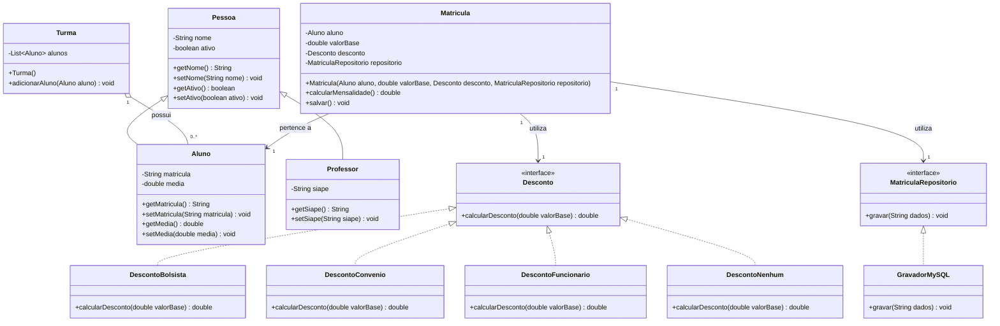

## Diagrama de Classes

```mermaid
classDiagram
    class Pessoa{
        -String nome
        -boolean ativo
        +getNome() String
        +setNome(String nome) void
        +getAtivo() boolean
        +setAtivo(boolean ativo) void
    }

    class Aluno{
        -String matricula
        -double media
        +getMatricula() String
        +setMatricula(String matricula) void
        +getMedia() double
        +setMedia(double media) void
    }

    Pessoa <|-- Aluno

    class Professor{
        -String siape
        +getSiape() String
        +setSiape(String siape) void
    }

    Pessoa <|-- Professor

    class Turma{
        -List~Aluno~ alunos 
        +Turma()
        +adicionarAluno(Aluno aluno) void
    }
    
    Turma "1" o-- "0..*" Aluno : possui

    class Matricula{
        -Aluno aluno
        -double valorBase
        -Desconto desconto
        -MatriculaRepositorio repositorio
        +Matricula(Aluno aluno, double valorBase, Desconto desconto, MatriculaRepositorio repositorio)
        +calcularMensalidade() double
        +salvar() void
    }

    class Desconto{
        <<interface>>
        +calcularDesconto(double valorBase) double
    }

    class DescontoBolsista{
        +calcularDesconto(double valorBase) double
    }

    class DescontoConvenio{
        +calcularDesconto(double valorBase) double
    }

    class DescontoFuncionario{
        +calcularDesconto(double valorBase) double
    }

    class DescontoNenhum{
        +calcularDesconto(double valorBase) double
    }

    Desconto <|.. DescontoBolsista
    Desconto <|.. DescontoConvenio
    Desconto <|.. DescontoFuncionario
    Desconto <|.. DescontoNenhum

    Matricula "1" --> "1" Desconto : utiliza
    Matricula "0..*" --> "1" Aluno : pertence a

    class MatriculaRepositorio {
        <<interface>>
        +gravar(String dados) void
    }

    class GravadorMySQL {
        +gravar(String dados) void
    }

    MatriculaRepositorio <|.. GravadorMySQL

    Matricula "1" --> "1" MatriculaRepositorio : utiliza
```